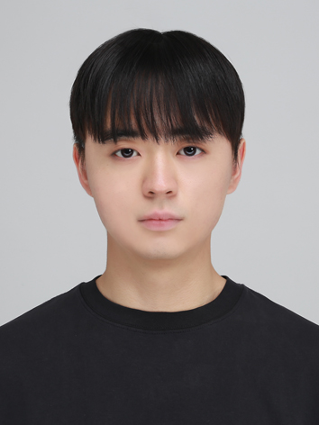

  

    
I am an undergraduate student in the <a href="https://ai.ssu.ac.kr/department/ai_software">School of AI Software at Soongsil University</a> and a researcher in the <a href="https://sites.google.com/view/ssu-nlp/home">Natural Language Processing Lab</a>. My research focuses on developing trustworthy language models by bridging the gap between their capabilities and the reliability required for real-world use. In particular, I am interested in improving factual reliability and robust reasoning through structured methods and rigorous evaluation. Ultimately, I aim to build language models whose capabilities and limitations are well understood and that people can confidently rely on in practical applications.

  

  

    
  

## News
For the latest news, please visit the [Natural Language Processing Lab](https://sites.google.com/view/ssu-nlp/home).

## Education
- **B.S. in AI Software, Soongsil University**  
  *Soongsil University · Mar 2023 - Present*  
  Advisor: [Chanjun Park](https://parkchanjun.github.io/)

## Work Experiences
- **Researcher, Natural Language Processing Lab**  
  *Soongsil University · Sep 2025 - Present*

## Links
- **Email:** [songjh2125@soongsil.ac.kr](mailto:songjh2125@soongsil.ac.kr)
- **GitHub:** [songjh2125](https://github.com/songjh2125)
- **LinkedIn:** [Jihun Song](https://www.linkedin.com/in/sjihun/)
- **Google Scholar:** [Jihun Song](https://scholar.google.com/citations?hl=en&user=CVpq8LQAAAAJ)
